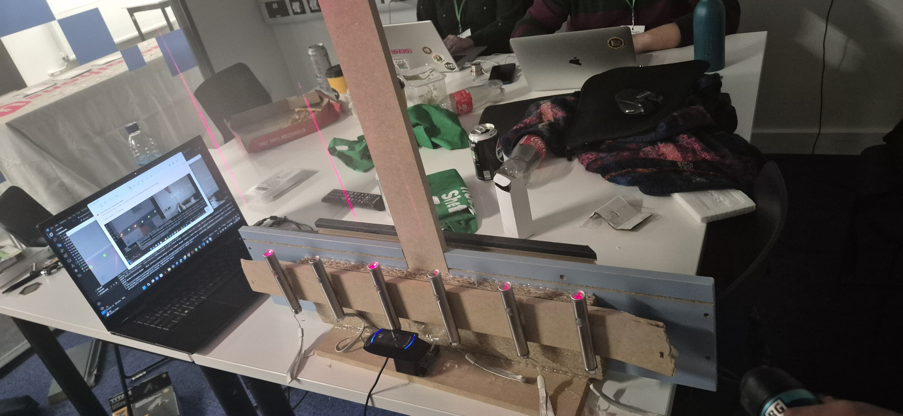
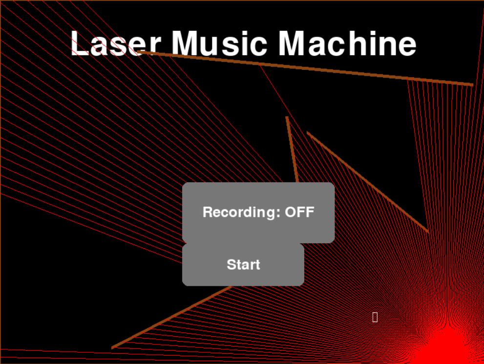
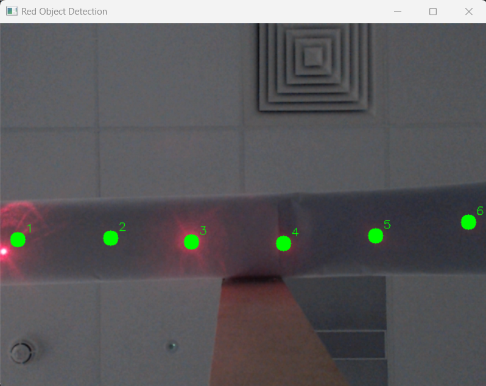
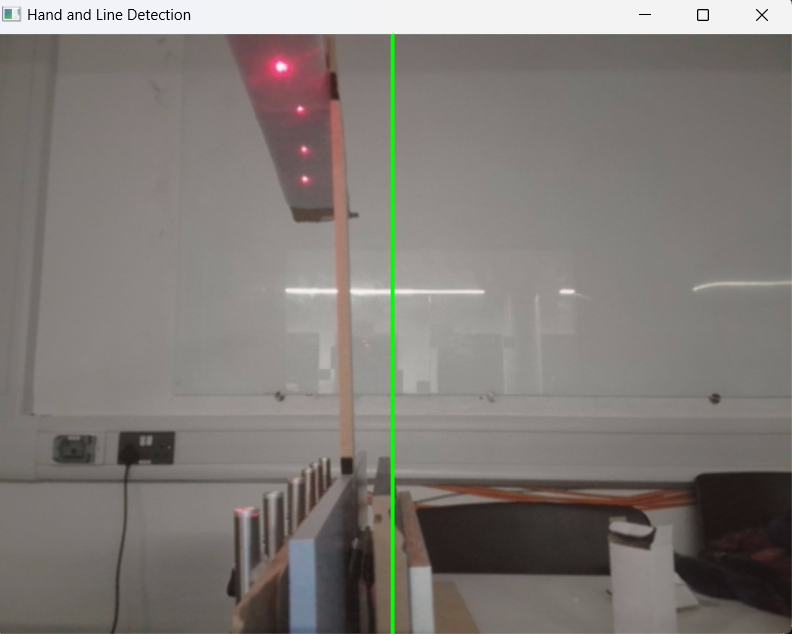

# Lasar Music Machine 🎶🏆

This is my project that won the Hackathons UK Hackiest Hack prize at [Hack Sheffield 9](https://hacksheffield.uk/) and here is my [devpost](https://devpost.com/software/laser-music-machine). Hackiest Hack means to build something over-the-top over engineered and held together with string and to use your imagination. This project is built using a box of scraps from B&Q, tape, a glue gun and lasers. Lasar Music Machine, inspired by Jean-Michel Jarre's lasar harp, turn's lasers into an interactive musical instrument. It uses computer vision to detect six laser beams, each corresponding to a musical note. When a laser is interrupted, the it plays the associated note, dynamically adjusting the pitch based on the height of your hand—higher for increased pitch and lower for decreased pitch. 




### How It Works

1. **The Start Screen (start.py)**: 
   When running the project, start with `start.py`, which displays a start screen with a canvas featuring red laser beams and walls of wood, created using Pygame. The mouse acts as a dynamic light source, casting rays in red using Bresenham's line algorithm to create a sunlight effect. The canvas also includes a toggle button to switch recording on and off, and a start button that will run `main.py`.



2. **Main (main.py)**
    This script uses the subprocess module to run lazarDetector.py and pitch.py sequentially.
   
3. **Lasar Detection (lazarDetector.py)**:
    When running `lazarDetector.py`, the script captures video from webcam 0 using OpenCV and processes each frame to detect red objects. It dynamically adjusts the HSV colour range for red detection using histogram analysis and CLAHE (Contrast Limited Adaptive Histogram Equalization). The ObjectTracker class tracks up to six objects by matching their positions using the Euclidean distance and the Hungarian algorithm. This algorithm ensures that each detected red object is paired with the closest tracked object, minimising the total distance between them. This optimal assignment helps maintain accurate and consistent tracking of multiple objects.

    Each tracked object corresponds to a musical note, which is played using Pygame's mixer module when the red object is detected. The script records the timing and notes played, saving this data to a CSV file. The system includes debounce logic, which prevents the same note from being played multiple times in quick succession by enforcing a minimum time interval between detections for each object. When the `q` key is pressed, the recording is saved, and the `end.py` script is executed.
   

   
4. **Pitch (pitch.py)**:
    When running `pitch.py`, the script captures video from webcam 1 using OpenCV and processes each frame to detect and track hand landmarks using MediaPipe. The script initialises the audio endpoint volume control using Pycaw, allowing it to adjust the system volume. A vertical green line is drawn in the middle of the screen, and the position of the index finger relative to this line is used to control the volume. The script calculates the percentage of the line's length corresponding to the finger's position and adjusts the system volume accordingly. The volume increases as the hand moves higher and decreases as it moves lower. It dynamically updates and displays the hand landmarks and volume percentage in real-time. When the `q` key is pressed, the screen closes.



5. **End Screen (end.py)**:
    When running `end.py`, the script is used for playback options. It features two main buttons: one to play the most recent recording and another to select and play a CSV file containing recorded notes. When a recording is played, the script reads the CSV file, which contains timestamps and note identifiers, and plays the corresponding notes using Pygame's mixer module.


### Installation Requirements

This project requires the following Python packages with specific versions. You can install them using `pip`:

```bash
pip install comtypes==1.4.8 mediapipe==0.10.18 numpy==2.1.3 opencv-python==4.10.0.84 opencv-python-headless==4.10.0.84 pycaw==20240210 pygame==2.6.1 scipy==1.14.1


run start.py
```

#### Package Details

- **OpenCV** (`opencv-python==4.10.0.84`, `opencv-python-headless==4.10.0.84`):  
  Used for image processing, video capture, and real-time object detection.

- **NumPy** (`numpy==2.1.3`):  
  Essential for array computing and numerical operations.

- **MediaPipe** (`mediapipe==0.10.18`):  
  Provides state-of-the-art computer vision solutions, including hand-tracking functionality.

- **Pygame** (`pygame==2.6.1`):  
  A library for rendering graphics, managing audio playback, and handling user input for interactive applications.

- **SciPy** (`scipy==1.14.1`):  
  Advanced mathematical and scientific computing, including spatial computations and optimizations.

- **Pycaw** (`pycaw==20240210`):  
  A Python library for managing system audio via Windows Core Audio APIs.

- **Comtypes** (`comtypes==1.4.8`):  
  Provides support for working with COM objects in Python, used in conjunction with Pycaw.

## Installation

Clone the repository:
   ```bash
   git clone https://github.com/jes4l/laser-music-machine
   ```


